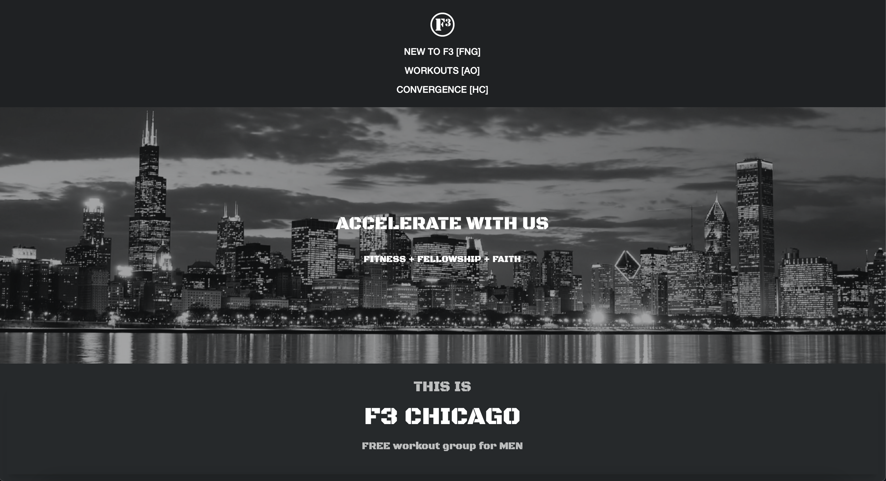

# Introduction

This is the local F3 region website for <https://www.f3chicago.com/> and is currently hosted on Netlify behind a simple Cloudflare domain registration.

To run it locally for development purposes, you can simply install the dependencies with `npm i` in your local terminal and then run `npm run dev` to access it at `http://localhost:3000`.

It's auto-deployed on commits to the `main` branch.

For context, this was heavily inspired with some copy/paste magic from F3 Boise's "Backslash" and F3 Twin Cities' "Lotus" via the F3 Nation Slack. This was also made available for broad use by F3 Muletown!

- <https://f3boise.com/>
- <https://f3twincities.com/>
- <https://f3muletown.com/>
